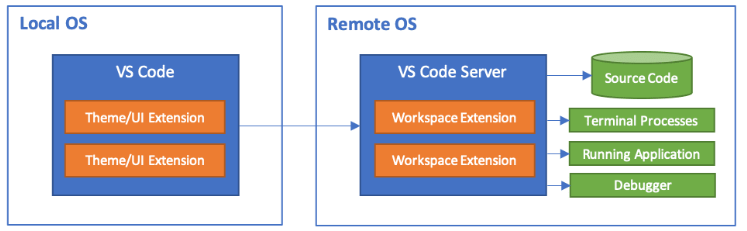
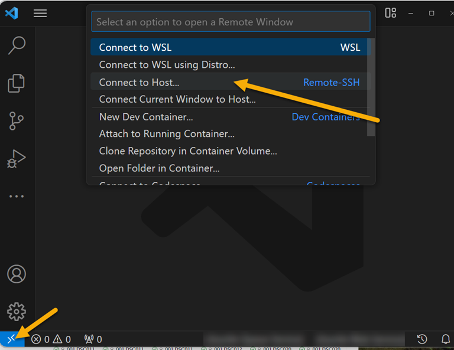
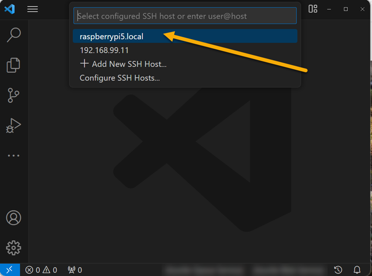

## Using a Raspberry Pi 5 as a remote Linux dev environment for Visual Studio Code

Pages in this article:
- [Overview (this page)](./)
- [Connecting the Pi to the PC](rpi-connect-pc.md)
  - [Setup Direct Ethernet connection](rpi-vscode-ethernet)
  - [Setup USB Gadget connection](rpi-usb-gadget)
- [Setup SSH on the PC and Pi](rpi-ssh-vscode-setup)
- [Sample Python Project](python_sample_project)
- [EXTRAS- older Pis and Docker](rpi-vscode-extras.md)

The enhanced performance of the Raspberry Pi 5 (Pi5) over previous models enables some new use cases for the Pi as a potential desktop PC replacement.  Software development is a common use, with Visual Studio Code (VSCode) being one of the recommended software packages in the full Pi desktop version.  Based on testing with a Pi5 8MB model, VSCode installs easily and runs properly on the Pi desktop.  When accessing the Pi5 OS desktop directly (that is, with keyboard/mouse/hdmi display), the UI is reasonably snappy, more so than on the Pi4.

Developing applications on the Pi5 that involve IO such as I2C, GPIO, etc. requires that the code be run on the Pi.  While direct access to the Pi OS desktop is usable, there may be reasons this is not preferable:
* The keyboard/mouse/display may be a second setup if you normally use a desktop PC for daily use.
* If you decide to remote into the Pi with VNC or RDP you may experience some UI issues.  In testing, the mouse movements were somewhat jerky even with high speed networking and a fast PC.
* Compared to a desktop the Pi5 still has limited memory and disk bandwidth (although NVME disks through the PCiE port may help this issue when readily available).  With a full desktop loaded along with the VSCode UI (written in Electron/NodeJS which is not particularly efficient), there may not be enough memory available to develop larger applications (for example, large python programs).
* Software development almost always requires an internet connection: source control load and save, installing libraries, etc.  Putting the Pi directly on your internal network may not be desired either because of security concerns or traffic burdens.

So if you are developing for the Pi5 hardware, or you simply want a "standard" linux environment for managing packages, compilation, etc., it is helpful to have a "low touch, resource efficient" way to run code on the Pi5 while using a full featured IDE such as VSCode on a full desktop PC with Windows or Mac.

Fortunately VSCode has an extension developed specifically for this case.  The [Remote-SSH extension](https://marketplace.visualstudio.com/items?itemName=ms-vscode-remote.remote-ssh) (along with some helper extensions to enhance the experience) lets you run the full VSCode UI on your desktop and remote over SSH to the Pi5 for access to files and code execution.  Because the extension only needs to send commands and data to the Pi, a smaller "shim" (called the VS Code Server) needs to run on the Pi, not the full UI. This is the way Microsoft shows this arrangement:

Furthermore, the Local VS code on your PC manages the remote server (even installs it for you) along with utilities that give you the full VS Code experience, including debugging.  For more information see the 
[Microsoft overview of VSCode remoting](https://code.visualstudio.com/docs/remote/remote-overview).

As noted above, you can develop with remote VS Code without having to access the Pi desktop.  In fact, unless you need the desktop for other purposes you should install the Lite version of the OS, saving disk space and memory.  There are many sources for help in OS installation, starting with the [Raspberry Pi site](https://www.raspberrypi.com/documentation/computers/getting-started.html#installing-the-operating-system).

### Using SSH for VS Code remote to your Pi5. 

There are two steps for using VS Code remote development with the Pi:
1. Connect your Pi5 to your PC such that there is communication between your PC and the Pi, and the Pi has access to the internet. There are multiple ways to make the connection as detailed in this document: [Connecting the Pi to the PC](rpi-connect-pc.md).
2. Create and install an SSH key on your PC and the Pi that secures SSH login.  While you can initially login to the Pi with the password setup when you image the OS, you will not be able to use password authentication practically during development because of the number of times authentication reoccurs.  This step is covered in the document: [Setup SSH on the PC and Pi](rpi-ssh-vscode-setup.md)

### Using VSCode Remote after connecting to the Pi
Once you have access to your Pi with SSH, run VSCode, load the Remote Extension as noted above, and connect within VSCode to the remote Pi as an sSH Host:

(Note, the Pi being tested was named raspberry5.local during the OS imaging, yours may be different)

Developing within VSCode now on the Pi is the same as on your local environment: you have access to the file system and terminal on the Pi, you can load extensions, and run and debug code.  See this [python sample](python_sample_project.md) for a more detailed look at how to setup projects and develop code with an IOT environmental sensor attached to the Pi.

