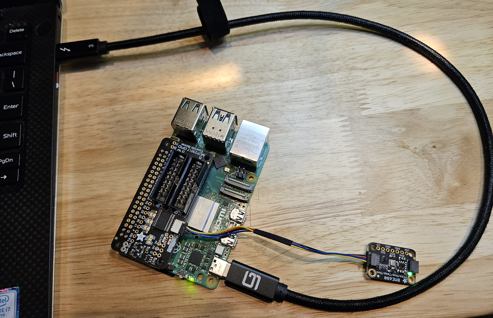

## Sample Project: Pi 5 Environmental Sensor using Remote VSCode and CircuitPython

Pages in this article:
- [Overview](./)
- [Connecting the Pi to the PC](rpi-connect-pc.md)
  - [Setup Direct Ethernet connection](rpi-vscode-ethernet)
  - [Setup USB Gadget connection](rpi-usb-gadget)
- [Setup SSH on the PC and Pi](rpi-ssh-vscode-setup)
- [Sample Python Project (this page)](python_sample_project)
- [EXTRAS- older Pis and Docker](rpi-vscode-extras.md)
<hr />
In this example we will use our Raspberry Pi 5 with some breakout boards from Adafruit programmed in CircuitPython.  Generally CircuitPython runs on micro-controllers with the CircuitPython runtime.  On the Pi with a full Linux OS Adafruit has built a software layer called Blinka that replaces the runtime while still offering compatibility with the hundreds of libraries for hardware supported by CircuitPython.  
Adafruit has an [excellent learn guide from Melissa](https://learn.adafruit.com/circuitpython-on-raspberrypi-linux/) that explains Blinka and gives step by step instructions for installing and using on the Pi.  This document follows the learn guide closely but adds some VSCode specific steps and tips.

#### Items for this sample

| Item | Adafruit Link |
| ---- | ------------- |
|[](https://www.adafruit.com/product/3660)|[Adafruit BME680 - Temperature, Humidity, Pressure and Gas Sensor - STEMMA QT](https://www.adafruit.com/product/3660)|
|[](https://www.adafruit.com/product/4132)|[Adafruit GPIO Expander Bonnet - 16 Additional I/O over I2C - STEMMA QT / Qwiic](https://www.adafruit.com/product/4132)|
|[](https://www.adafruit.com/product/4210)|[STEMMA QT / Qwiic JST SH 4-pin Cable - 100mm Long (other lengths available)](https://www.adafruit.com/product/4210)|
||For Pi 5 components available from Adafruit, see the [Intro document](README.md)|

#### Assembling the project

With the recent upgrade (Oct. 2023) of the GPIO expander bonnet to include a STEMMA QT/Qwiic connector, this is a no-soldering project.  With the Pi powered down, press the bonnet on top of the Pi GPIO pins, connect the JST-SH cable between the bonnet and either STEMMA connector on the BME680 breakout, and you're ready to code.  For more info see the learn guides:
* [Adafruit GPIO Expander Bonnet](https://learn.adafruit.com/gpio-expander-bonnet/overview)
* [Adafruit BME680](https://learn.adafruit.com/adafruit-bme680-humidity-temperature-barometic-pressure-voc-gas)

The assembled project might look like:


#### Steps to follow for the sample

1. Assemble the components to your Pi as detailed above.
2. Setup the Pi for SSH as described in the intro and other documents.
3. Connect VSCode remote through SSH to your Pi.
4. For this CircuitPython example (or any other python project) load the VSCode python extension in the remote (if you have the extension loaded on your PC you can find it in the extensions app and tell VSCode to install in the remote)
5. In the remote terminal execute the following:
```
sudo apt-get update
sudo apt-get upgrade
sudo apt-get install python3-pip
sudo apt install --upgrade python3-setuptools
```
6. Create a project folder for your new project; this should be separate from other projects because you will be creating a virtual environment that is tied to that project.  
Best practices vary but let's assume that you put a "projects" folder in your user directory
to contain your projects.  Then create a folder for this specific example project, 
for example "testblinka".  So then we have a path:  

    ~/projects/testblinka

7. In VSCode open the project folder as your workspace.  You can either do File/Open Folder... and select the project folder, or in the terminal do:  
```
cd ~/projects/testblinka
code .
```  
    (Yes, that is a "dot" after code, which restarts code in the current directory)
8. Next create a virtual environment for the python libraries and execution stack. 
You can do this one of two ways: using the built in helper in VSCode from the python extension, or through the command line.  Using the VSCode helper has the advantage that certain files are pre-populated like a .gitignore within the virtual environment.  The net effect is a folder named ".venv" that has links to the python interpreter (choose the default loaded with the Pi) and various other files and structures that are setup for loading libraries (the Pi 5 OS now requires virtual environments for python).  
If you prefer to use the command line do:  
`python -m venv .venv --system-site-packages`  
Note that the name of the directory for the virtual environment can be any valid name, but using a dot-folder keeps directory listings cleaner by default. (If you have trouble with the venv command make sure it is installed with `sudo apt install python3.11-venv`)  
If you use the built in VSCode virtual environment helper, you will need to edit the pyenv.cfg in the .venv folder afterward to have:  
`include-system-site-packages = true`
9. Now you need to "activate" your virtual environment.  This is required whenever you install libraries or run your code.  Normally once the environment has been created, just open a new terminal window and VSCode should detect the environment and run the activation script.  
You will then see something like:  
`(.venv) pi@raspberrypi:~/projects/testblinka $`  
The "(.venv)" prefix tells you the environment is active.  If VSCode doesn't activate the environment automatically, just run the script that was generated when the environment was created:  
`source .venv/bin/activate`  
or use the alias for "source":  
`. .venv/bin/activate`
10. Finally you are ready to install Blinka and get ready to code!    
In the terminal with the virtual environment active do:  
```
pip3 install --upgrade adafruit-python-shell
wget https://raw.githubusercontent.com/adafruit/Raspberry-Pi-Installer-Scripts/master/raspi-blinka.py
sudo -E env PATH=$PATH python3 raspi-blinka.py
```
11. If there were no errors in the installation, the script will prompt to reboot the Pi. You can accept the action to reboot, after which VSCode will attempt to re-connect when the Pi comes back up.  You will probably get a message to reload the window which should get you back to the project folder.  Otherwise you can say "No" to the prompt and handle the reboot and reconnect manually.

12.  The Blinka install activates certain hardware functions like I2C and SPI.  It also installs the built-in libraries such as "board".  So you can do a couple of quick checks to make sure everything installed properly:  
* In the terminal with the virtual environment active, run "Python", then in the REPL type:  
```
import board
dir(board)
```   
    You should not get any errors and you should see a listing of board pins like "['CE0', 'CE1', 'D0', etc...].
* In the terminal with the environment active, run:  
`ls /dev/i2c* /dev/spi*`  
You should get one or more lines like:  
`/dev/i2c-1   /dev/i2c-12     /dev/spidev0.1`
13. Now let's write some code to use our BME680 environmental sensor.  Again, with the virtual environment active, install the library for the sensor:  
`pip install adafruit-circuitpython-bme680`  
Alternately, you can create a requirements file with libraries needed for your application.  In this case it's about the same amount of typing, but if you have a number of libraries it can help be helpful.  Create a file in the root of the project called "requirements.txt" (that is the convention but the name can be anything).  In the file put:  
`adafruit-circuitpython-bme680`  
Then you can run the command to install all the libraries in the file:  
`pip install -r requirements.txt`  
There are a number of utilities to help with requirements files. For example, if you have a set of 
python source files with imports in them, you can use this to generate requirements from the code:  
[https://github.com/bndr/pipreqs](https://github.com/bndr/pipreqs)

14. Create a code file (such as "testbme680.py") in the project directory with the following code:
```python
import board
import adafruit_bme680
import time
i2c = board.I2C()
sensor = adafruit_bme680.Adafruit_BME680_I2C(i2c)
#
while(True):  
    print('Temperature: {} degrees C'.format(sensor.temperature))
    print('Gas: {} ohms'.format(sensor.gas))
    print('Humidity: {}%'.format(sensor.humidity))
    print('Pressure: {}hPa'.format(sensor.pressure))
    time.sleep(3)
```
15. With the virtual environment active, in the terminal type:  
`python testbme680.py`  
(there is also a run button above the source file that will do the same thing)  
In the terminal the program should print the readings from the sensor every 3 seconds.  You can also debug the program using the debug selection from the pulldown next to the run button above the source file, or you can click on the Run and Debug application on the sidebar.

16.  Now that you are developing and testing your application, it's always best practice to setup a git repository to safeguard your work and potentially collaborate with others.  VScode has first class support for git operations. Assuming you installed git when you setup your Pi (see the [SSH Setup Doc](rpi-ssh-vscode-setup.md)), you can create a local repository in the project directory by using the Source Control application in the sidebar.  Before you commit our initial files you may want to create a ".gitignore" file to exclude files not desired in source control (such as secrets or temp folders).  
If you used the VSCode helper to create the virtual environment there is already a .gitignore that excludes the virtual environment folder (you should never commit that folder, it has links specific to the Pi).  If not, or if you have other files to exclude, you may want a more comprehensive .gitignore.  Github has a library of many language and environment specific .gitignore templates at:  
[https://github.com/github/gitignore/tree/main](https://github.com/github/gitignore/tree/main)

17.  Once your .gitignore is in place, commit your files to the local repo.  Then the VSCode Source Control app will show a button to let you push your repo to your Github account.  If you were logged in to Github on your PC the Remote Extension will securely pass your credentials to the Pi to enable you to complete the publish.  
Similarly, as you make changes to your application you can push new commits to Github, either direct to your default branch or to new branches.  Also, if you load the Github extension in VSCode you can do pull requests right from the UI, including reviewing and closing.


