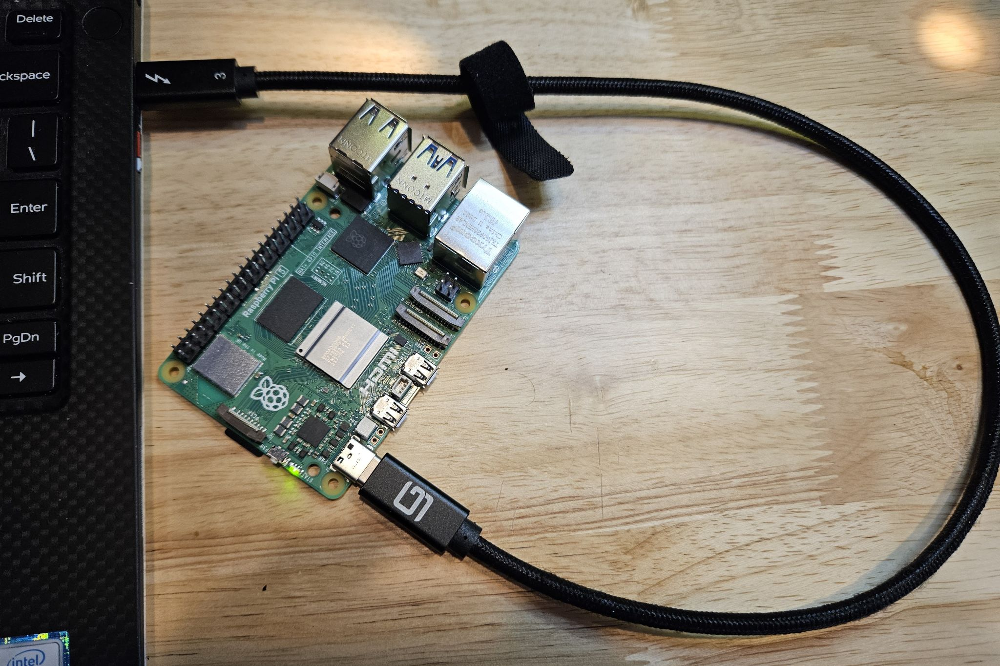

### Connect Raspberry Pi 5 to PC with USB-C Gadget Mode

Of the 4 techniques in this article for connecting the Pi to your PC, this is the simplest from a hardware perspective.

Power and data are provided by a USB-C cable from your laptop to the "power" connector on the Pi.  The connector on the Pi is part of the onboard USB controller that provides several modes for communications.  One is the typical On-The-Go USB type found on phones.  Another is what is called "USB Gadget" mode where the port can act as a network device, in particular an Ethernet port.  Then the PC can recognize the device as implementing Ethernet through a standardized protocol (for Windows, this is termed RNDIS).  At that point the connection looks very similar to the setup described in the [Ethernet document](rpi-vscode-ethernet.md) in this article.

While this approach has advantages of simple hardware and portability, there are several caveats:
* Powering the Pi from the USB port on the laptop requires a port that can **continuously** supply at least 3A (15W).    Typically this means Thunderbolt ports.  Also the cable must be PD capable with good data performance; as shown in the image above a Thunderbolt cable is a safe choice.
* From the Pi side the power consumption will need to be managed.  In testing with a Dell XPS-13 laptop the Pi was stable for all VSCode interaction with no additional hardware attached to the Pi.  It was also tested with a small expansion HAT (actually an Adafruit expansion bonnet) and an I2C environmental sensor (Adafruit BME680, see the [sample project](python_sample_project.md)) with no issues.  Higher power devices such as HATs with displays, etc., may cause brown-out due to the inability of the laptop port to supply surge current.  You will want to test your setup carefully before committing to extensive coding.
* Finally, the setup of the laptop and Pi to enable this connection is fairly complicated, especially on the Pi side.  If you are not comfortable with Linux one of the other connection types might be preferable.  But the setup on the Pi side is one time only so if you can get through it successfully it is a nice, compact kit!

The steps listed below are borrowed heavily from a great blog post (one of many for Pi connectivity over time) from [Ben Hardill - "Pi5 USB-C Gadget"](https://www.hardill.me.uk/wordpress/2023/12/23/pi5-usb-c-gadget/).  *Many thanks, Ben!*

- new image of os lite with no wifi
- connect pi with ethernet and turn on ics (assuming pi ethernet is 3):
disable-ics
set-ics "Wi-Fi" "Ethernet 3"

- setup pi for ssh per docs
*(clear raspberrypi5.local from known_hosts)
install -d -m 700 ~/.ssh
nano ~/.ssh/authorized_keys
* (copy in the text from the .pub file of the ssh key, save and exit)
ssh-ed25519 AAAAC3NzaC1lZDI1NTE5AAAAIKrQrj/B4w2M/dcsz5xKXjj+eyMImPdIHZ+Jhur1TW/8 spadg@STAN-XPS13

sudo chmod 644 ~/.ssh/authorized_keys  
sudo chown pi:pi ~/.ssh/authorized_keys

- exit ssh and re-connect
- update pi
sudo apt update
sudo apt full-upgrade

- update firmware
sudo rpi-update
* (reboot)

- add Kernel configs
sudo nano /boot/config.txt
dtoverlay=dwc2

sudo nano /boot/cmdline.txt
modules-load=dwc2

sudo nano /etc/modules
libcomposite

- contents of usb-gadget.sh to file
sudo nano /usr/local/sbin/usb-gadget.sh
* (put in contents)
sudo chmod +x /usr/local/sbin/usb-gadget.sh

- contents of usbgadget.service into file:
sudo nano /lib/systemd/system/usbgadget.service
* (put in contents)
sudo systemctl enable usbgadget.service

- setup network bridge - **** note leaving off last line from article, not setting static ip
sudo nmcli con add type bridge ifname br0
sudo nmcli con add type bridge-slave ifname usb0 master br0
sudo nmcli con add type bridge-slave ifname usb1 master br0

- install dnsmasq, config
sudo apt-get install dnsmasq
sudo nano /etc/dnsmasq.d/br0

dhcp-authoritative
dhcp-rapid-commit
no-ping
interface=br0
dhcp-range=10.55.0.2,10.55.0.6,255.255.255.248,1h
dhcp-option=3
leasefile-ro

- shut down the pi and remove ics
sudo shutdown now
disable-ics

- connect laptop to pi with usb c, wait until usb errors and then comes back up as rndis, then connect ics
get-netadapter
set-ics "Wi-Fi" "Ethernet 6"

- connect to pi and verify
ssh pi@raspberrypi5.local
ping www.google.com

!!!!success !!!

