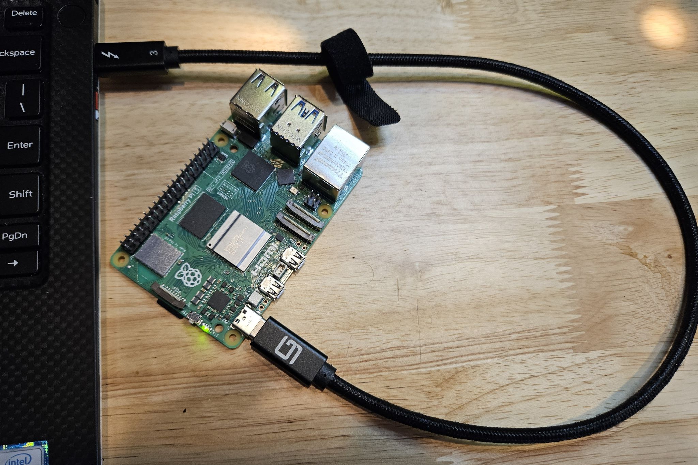

### Connect Raspberry Pi 5 to PC with USB-C Gadget Mode

Of the 4 techniques in this article for connecting the Pi to your PC, this is the simplest from a hardware perspective.



Power and data are provided by a USB-C cable from your laptop to the "power" connector on the Pi.  The connector on the Pi is part of the onboard USB controller that provides several modes for communications.  One is the typical On-The-Go USB type found on phones.  Another is what is called "USB Gadget" mode where the port can act as a network device, in particular an Ethernet port.  Then the PC can recognize the device as implementing Ethernet through a standardized protocol (for Windows, this is termed RNDIS).  At that point the connection looks very similar to the setup described in the [Ethernet document](rpi-vscode-ethernet.md) in this article.

While this approach has advantages of simple hardware and portability, there are several caveats:
* Powering the Pi from the USB port on the laptop requires a port that can **continuously** supply at least 3A (15W).    Typically this means Thunderbolt ports.  Also the cable must be PD capable with good data performance; as shown in the image above a Thunderbolt cable is a safe choice.
* From the Pi side the power consumption will need to be managed.  In testing with a Dell XPS-13 laptop the Pi was stable for all VSCode interaction with no additional hardware attached to the Pi.  It was also tested with a small expansion HAT (actually an Adafruit expansion bonnet) and an I2C environmental sensor (Adafruit BME680, see the [sample project](python_sample_project.md)) with no issues.  Higher power devices such as HATs with displays, etc., may cause brown-out due to the inability of the laptop port to supply surge current.  In testing the Pi 5 standard case with the cooling fan seemed to cause disconnects; you may want to use a passive cooling case.  You will want to test your setup carefully before committing to extensive coding.
* Finally, the setup of the laptop and Pi to enable this connection is fairly complicated, especially on the Pi side.  If you are not comfortable with Linux one of the other connection types might be preferable.  But the setup on the Pi side is one time only so if you can get through it successfully it is a nice, compact kit!

The steps listed below are borrowed heavily from a great blog post (one of several for Pi connectivity over time) from [Ben Hardill - "Pi5 USB-C Gadget"](https://www.hardill.me.uk/wordpress/2023/12/23/pi5-usb-c-gadget/).  *Many thanks, Ben!*

1. It is highly recommended to start with a new image of the Raspberry Pi OS.  Also, the Lite version is recommended to minimize memory footprint.
2. When you are imaging your SD card with [Raspberry Pi Imager](https://www.raspberrypi.com/software/) you need to decide how you will connect your PC to the Pi to do the Gadget setup (you can't connect over USB until the setup is done).  You can use any of the other three methods listed in the [intro document](README.md), but Ethernet is recommended.  Wifi can be used, but you will need to turn it off before rebooting into Gadget mode; that can get tricky if Wifi is pre-configured during SD imaging, but it can be done with linux network commands at the end of Gadget setup.
3. Connect your Pi to your PC using your selected method.  If you chose direct Ethernet turn on ICS per the [instruction document](rpi-vscode-ethernet.md).  Just remember to turn off ICS before you reboot the Pi once Gadget setup is done because you will need to turn ICS back on for the Gadget device.
4. Once the PC and Pi are connected, setup the Pi for SSH connectivity per [the instruction document](rpi-ssh-vscode-setup.md).  After the SSH key is in place on your PC and the Pi, disconnect and reconnect in your terminal to ensure the password is not requested.
5. From the SSH connection in your terminal fully update the Pi:
```
sudo apt update
sudo apt full-upgrade
```
6. Per the note at the end of the intro document, you may need to do a firmware upgrade to enable the Gadget feature that was broken and then patched at the end of 2023.  At some point this will be in production boards or in the full-upgrade done above. But you can always do this step to be sure:
```
sudo rpi-update
```
    You will then need to reboot the Pi. 

    The next steps closely follow Ben's article; you may want to refer to his excellent explanations.  Changes that were needed for the VSCode operation will be noted.

7. First add Kernel configuration (boot) changes:
```
sudo nano /boot/config.txt
-> Add the following line to end of file, save and exit editor:
dtoverlay=dwc2
-> next...
sudo nano /boot/cmdline.txt
-> Add ght following to end of line including the space before, no newline!, save and exit editor
 modules-load=dwc2
-> next...
sudo nano /etc/modules
-> Add to end of file, save and exit editor:
libcomposite
```
8. Next you will create a script that will generate the configuration data that is used to spin up the Gadget virtual device; several are created, the RNDIS one is for windows.
```
sudo nano /usr/local/sbin/usb-gadget.sh
-> Add the following in the file:
#!/bin/bash
cd /sys/kernel/config/usb_gadget/
mkdir -p display-pi
cd display-pi
echo 0x1d6b > idVendor # Linux Foundation
echo 0x0104 > idProduct # Multifunction Composite Gadget
echo 0x0103 > bcdDevice # v1.0.3
echo 0x0320 > bcdUSB # USB2
echo 2 > bDeviceClass
mkdir -p strings/0x409
echo "fedcba9876543213" > strings/0x409/serialnumber
echo "Ben Hardill" > strings/0x409/manufacturer
echo "Display-Pi USB Device" > strings/0x409/product
mkdir -p configs/c.1/strings/0x409
echo "CDC" > configs/c.1/strings/0x409/configuration
echo 250 > configs/c.1/MaxPower
echo 0x80 > configs/c.1/bmAttributes
#ECM
mkdir -p functions/ecm.usb0
HOST="00:dc:c8:f7:75:15" # "HostPC"
SELF="00:dd:dc:eb:6d:a1" # "BadUSB"
echo $HOST > functions/ecm.usb0/host_addr
echo $SELF > functions/ecm.usb0/dev_addr
ln -s functions/ecm.usb0 configs/c.1/
#RNDIS
mkdir -p configs/c.2
echo 0x80 > configs/c.2/bmAttributes
echo 0x250 > configs/c.2/MaxPower
mkdir -p configs/c.2/strings/0x409
echo "RNDIS" > configs/c.2/strings/0x409/configuration
echo "1" > os_desc/use
echo "0xcd" > os_desc/b_vendor_code
echo "MSFT100" > os_desc/qw_sign
mkdir -p functions/rndis.usb0
HOST_R="00:dc:c8:f7:75:16"
SELF_R="00:dd:dc:eb:6d:a2"
echo $HOST_R > functions/rndis.usb0/dev_addr
echo $SELF_R > functions/rndis.usb0/host_addr
echo "RNDIS" >   functions/rndis.usb0/os_desc/interface.rndis/compatible_id
echo "5162001" > functions/rndis.usb0/os_desc/interface.rndis/sub_compatible_id
ln -s functions/rndis.usb0 configs/c.2
ln -s configs/c.2 os_desc
udevadm settle -t 5 || :
ls /sys/class/udc > UDC
sleep 5
nmcli connection up bridge-br0
nmcli connection up bridge-slave-usb0
nmcli connection up bridge-slave-usb1
sleep 5
service dnsmasq restart
-> Save and exit the editor then do:
sudo chmod +x /usr/local/sbin/usb-gadget.sh
```
9. Next you create a systemd service descriptor file that will run the script above on boot:
```
sudo nano /lib/systemd/system/usbgadget.service
-> Add the following in the editor:
[Unit]
Description=My USB gadget
After=network-online.target
Wants=network-online.target
#After=systemd-modules-load.service
[Service]
Type=oneshot
RemainAfterExit=yes
ExecStart=/usr/local/sbin/usb-gadget.sh
[Install]
WantedBy=sysinit.target
-> Save the file and exit the editor, then do:
sudo systemctl enable usbgadget.service
```
10. Setup network bridge.  NOTE this is different than Ben's process in that his last line that assigns a static IP to the Gadget interface is left out.  That then puts the Gadget virtual Ethernet interface in IPV4.auto mode which let's the ICS service on the PC assign an address to give the Pi internet access through the PC. At the terminal:
```
sudo nmcli con add type bridge ifname br0
sudo nmcli con add type bridge-slave ifname usb0 master br0
sudo nmcli con add type bridge-slave ifname usb1 master br0
```
11. Next install and configure dnsmasq.  While this is not used once ICS is enabled on the PC, it does appear to be needed during the initial phase of the Gadget configuration.
```
sudo apt-get install dnsmasq
sudo nano /etc/dnsmasq.d/br0
-> Add the following in the editor, save and exit the editor:
dhcp-authoritative
dhcp-rapid-commit
no-ping
interface=br0
dhcp-range=10.55.0.2,10.55.0.6,255.255.255.248,1h
dhcp-option=3
leasefile-ro
```
12. If you used Wifi for the setup, turn it off and disable as you exit.  You will need to search for the best way to do this, seems to vary depending on how the imager did the Wifi config.
13. Shut down the Pi and remove ICS on the PC if you used the direct Ethernet method.
14. Connect the laptop to the Pi with your USB-C cable. Wait until the Pi has fully booted and the virtual Ethernet RNDIS device is reported using the "ipconfig /all" command on the PC. **NOTE**, as of January 2024 this setup process results in an initial USB error saying the device is not recognized.  However, if you wait another minute or two it should then signal that a good USB port was recognized and work properly.  *If anyone knows what is causing this or has a solution it would be greatly appreciated*.
15. Once the Ethernet RNDIS device is up on the PC, activate ICS by sharing your internet network adapter with the Pi Ethernet device.  Details can be found in the [direct ethernet guide](rpi-vscode-ethernet.md), using either the Windows Control Panel GUI or Powershell.  For example, in Powershell:
```
get-netadapter
-> copy the names of the interface having internet access (the Public IF) to the Gadget interface (the Private IF), then enter (as an example)
set-ics "Wi-Fi" "Ethernet 6"
```
16. Now connect to the Pi with SSH in your terminal and verify the Pi has internet access:
```
ssh pi@raspberrypi.local
-> Now in the Pi terminal:
ping www.google.com
-> you should get good responses from Google
```

**Congratulations!** You can now run VSCode and connect to the remote SSH host to begin development.  You should not have to change anything on the Pi when you reboot or power down.  On the PC you should be able to reboot the Pi with no changes needed.  If you remove the Pi USB cable from your PC and connect other similar USB devices (like a regular Ethernet adapter), it is advisable to remove the ICS sharing before connecting the Pi again.  Then just start at step 14 above.


