## Connect Raspberry Pi 5 to PC with Ethernet

Pages in this article:
- [Overview](./)
- [Connecting the Pi to the PC](rpi-connect-pc.md)
  - [Setup Direct Ethernet connection (this page)](rpi-vscode-ethernet)
  - [Setup USB Gadget connection](rpi-usb-gadget)
- [Setup SSH on the PC and Pi](rpi-ssh-vscode-setup)
- [Sample Python Project](python_sample_project)
- [EXTRAS- older Pis and Docker](rpi-vscode-extras.md)

A direct Ethernet connection is a low-cost, performant method of connecting your Pi to your PC for remote development.  It offers several benefits:
* Isolates the Pi to a private network with pass-through internet access via your PC.
* Ethernet is a durable connection so you typically would have no drop-outs that wifi might experience.

A typical setup might look like:

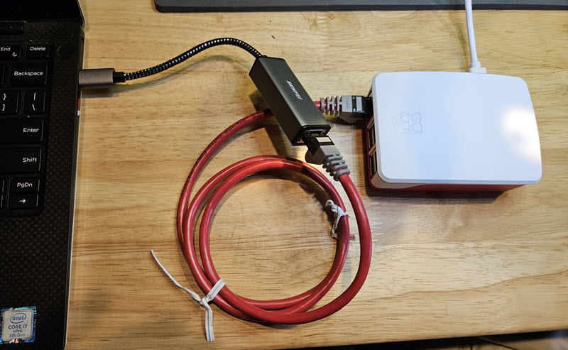

The two components shown are:
1. ***USB to Ethernet adapter.***  If you have Ethernet on your PC and don't plan to use it for internet you can plug in there instead.  A typical USB-C to Ethernet adapter is [here](https://a.co/d/iSMJby9).  You could also use a small travel dock that has an Ethernet connection, like [here](https://a.co/d/cZiTq9g).
2. ***Ethernet Crossover Cable***  This enables the two device ports to connect by swapping the data lines in a cable instead of requiring two network switch jacks to do the same thing.  You could use a small switch if you have it but that increases the component complexity.  A typical crossover cable is [here](https://a.co/d/2ZEJxe5).  If you want to just use one of your patch cables there are also [adapters, like here](https://a.co/d/bcpnuNY).  For the DIY'er, the wiring needed for the crossover is shown in Appendix 2.

Once you have the components you need, start with your PC up and on the internet but your **Pi turned off**.  Make the Ethernet connection similar to the image above. 

Now on your PC you need to turn on a Windows feature called "Internet Connection Sharing (ICS)".  This is enabled by sharing a specific network adapter which is connected to internet access (this is called the public connection).  The sharing is done to the ethernet connection to your Pi (called the private connection).

Enabling ICS is typically done through the control panel.  (You can also use a powershell script as detailed in the appendix 1 below.)  In control panel you navigate to the network adapters as shown below (you might also try entering `Control Panel\Network and Internet\Network and Sharing Center` in the address line of a file explorer, then clicking on change adapter settings):

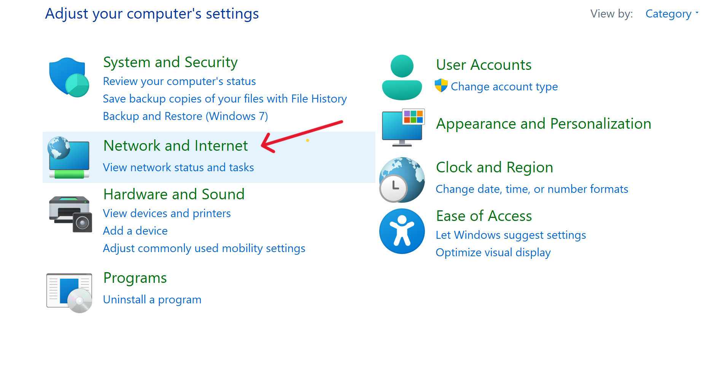

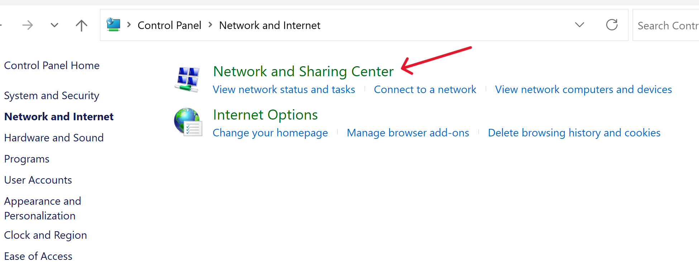

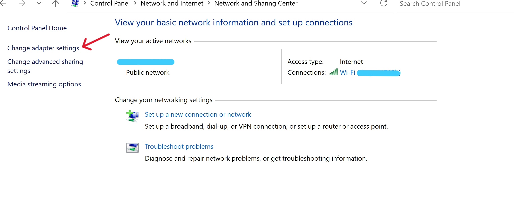

The resulting window will have an icon for each adapter of the various types.  For example, this shows a wi-fi connection that has internet access and an ethernet adapter that is connected to the Pi, but not yet active because the Pi is off:

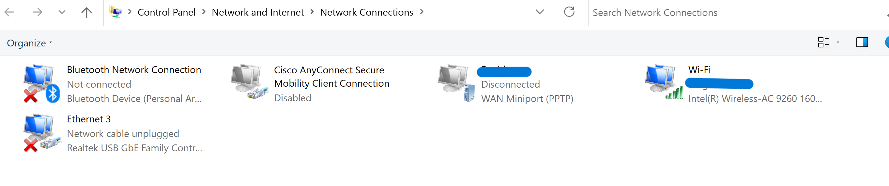

Assuming we want to share the wifi connection to the Pi ethernet, right click the wifi and select Properties:

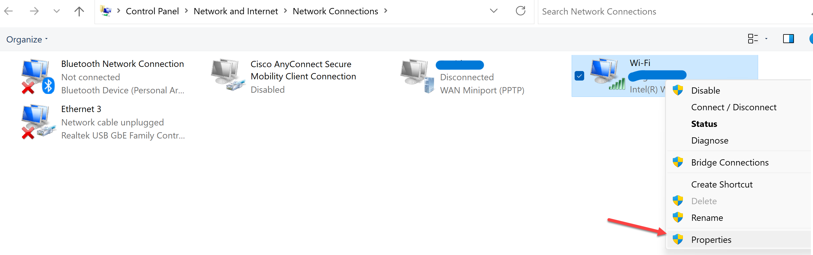

When the dialog comes up select the Sharing tab:

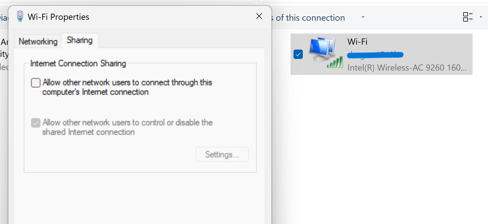

If there is only one adapter that is capable of accepting the share (in this example there is just the Pi ethernet), you will just have a checkbox to enable.

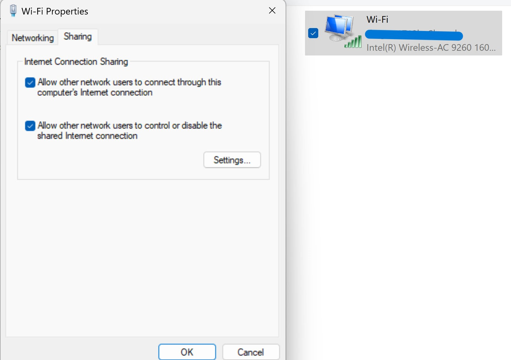

Once you click OK the connection will be shared the wifi adapter will be denoted as shared:

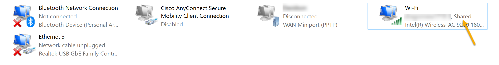

If there is more than one adapter capable of being a sharing target, there will be a dropdown below the sharing checkbox.  For example, here another ethernet adapter has been connected:

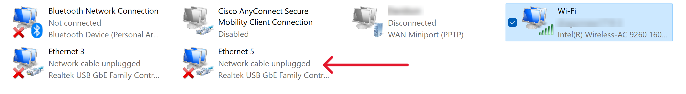

Now if you share the wifi connection you will get a dropdown showing both ethernet adapters:

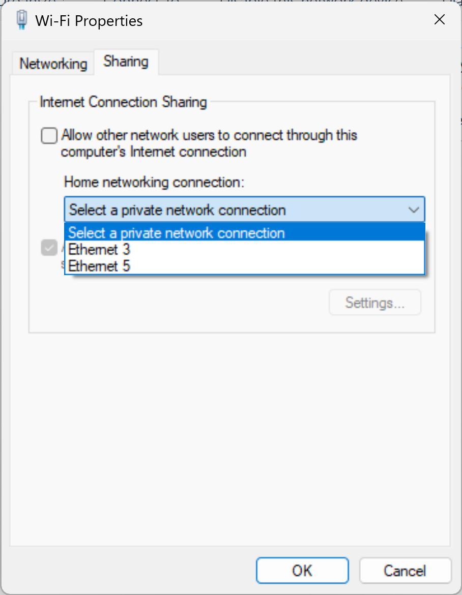

You can only pick one; that is, the internet connection can only be shared to one other interface.  Similarly if your internet connection was on one of the ethernet interfaces the dropdown box would have the wifi and other ethernet listed.  If you shared one ethernet to another, note that you should disconnect the wifi to keep ICS from getting confused.  Normally Windows does this for you but if not you should disconnect manually.

Once you have shared the internet-connected interface to the Pi ethernet, turn on the Pi.  After the Pi boots give it another minute or two to make the pass-through connection.  ICS is providing a limited DHCP service to give the Pi interface a network address.  It also provides a DNS resolver so the Pi can get to internet resources by name.

ICS is in control of the shared interface including IP addresses and routing.  To access the Pi it is best to use the mDNS local name such as <pi-hostname>.local (raspberrypi.local unless you changed the hostname).  ICS may assign either IPv4 or IPv6 addresses or both, so it is hard to tell which one is being used.  But the .local address should work fine.  See the [Pi SSH VSCode setup pages](rpi-ssh-vscode-setup.md) for details on accessing the Pi.

ICS is an older feature in Windows, although still fully supported through Windows 11.  However you don't have control of details such as DHCP ranges, etc.  Also ICS appears to use some low level identifiers when configured, such as MAC addresses or even internal UIDs.  So best practice is to disable sharing when you make any changes to the configuration and then re-enable once the changes are made.  For example, if you re-image your Pi it is best to un-share the connection on the PC before re-booting the Pi.

### Appendix 1: Managing ICS with Poweshell ###

If you would rather enable and disable ICS with scripting there is a powershell module that makes it easy.  The module with instructions can be found [at this github repo](https://github.com/loxia01/PSInternetConnectionSharing).  As noted in the readme you will need to have your powershell execution policy set correctly and have setup install-module before installing.

In order to use the module you will need to run powershell in administrator mode.  If you have windows terminal installed (which you should!) you can hold the shift key while right-clicking the start button on the taskbar.  You will get an entry for `Terminal (Admin)`.  Open a powershell tab if it's not your default.

You can first check to see if ICS is running with the command:

`get-ics`

If ICS is not enabled nothing will be returned.  Assuming it is not you will want to enable it with the command: 

`set-ics '<public connection name>' '<private connection name>'`

For example:

`set-ics 'Wi-Fi' 'Ethernet 3'`

would share the wifi connection to the named ethernet interface.

Note that the parameters are strings and must match the interface names exactly.  To help with being able to copy and paste the names you can use the helper command:

`get-netadapter`

You will get a table of devices something like:

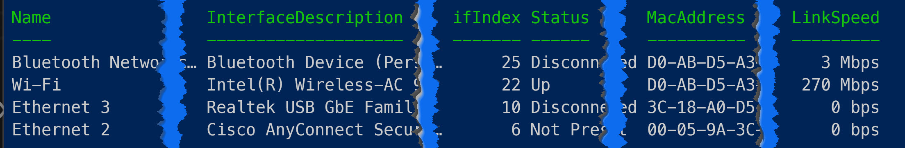

Just copy and paste from the Name column to the respective set-ics command parameters.

You can verify that ICS is setup correctly with the get-ics command which gives a table like:

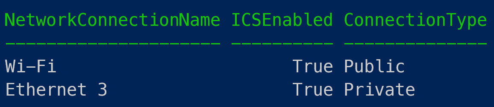

To tear down ICS just enter the command:

`disable-ics`

Nothing is returned but you can always run get-ics to check.

### Appendix 2: Wiring an Ethernet crossover

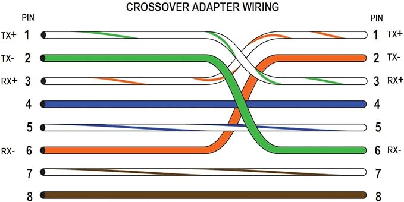
