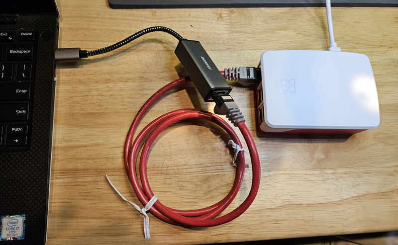

### Connect Raspberry Pi 5 to PC with Ethernet

A direct Ethernet connection is a low-cost, performant method of connecting your Pi to your PC for remote development.  It offers several benefits:
* Isolates the Pi to a private network with pass-through internet access from your PC.
* Ethernet is a durable connection so you typically would have no drop-outs that wifi might experience.

A typical setup might look like:

The two components shown are:
1. ***USB to Ethernet adapter.***  If you have Ethernet on your PC and don't plan to use it for internet you can plug in there instead.  A typical USB-C to Ethernet adapter is [here](https://a.co/d/iSMJby9).  You could also use a small travel dock that has an Ethernet connection, like [here](https://a.co/d/cZiTq9g).
2. ***Ethernet Crossover Cable***  This enables the two device ports to connect by swapping the data lines in a cable instead of requiring two network switch jacks to do the same thing.  You could use a small switch if you have it but that increases the component complexity.  A typical crossover cable is [here](https://a.co/d/2ZEJxe5).

Once you have the components you need, start with your PC up and on the internet but your **Pi turned off**.  Make the Ethernet connection similar to the image above. 

Now on your PC you need to turn on a Windows feature called "Internet Connection Sharing (ICS)".  

@@@ if changing the shared connection (such as between wireless and ethernet), un-share the shared connection first before changing.  This also applies if you re-image your Pi.

@@@ make sure you only have one internet  connection, ICS may not work if you have both a wireless and LAN connection.

