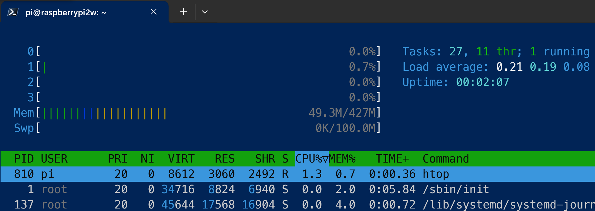
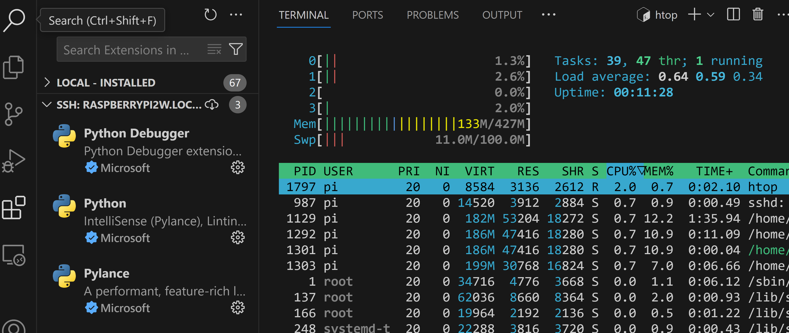
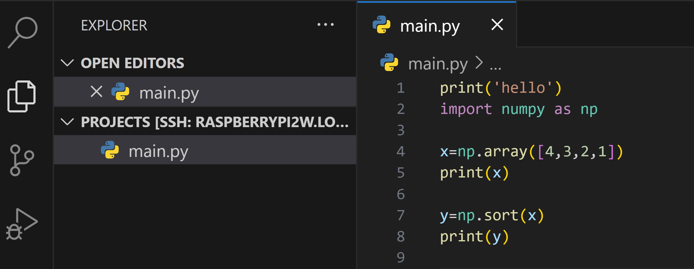
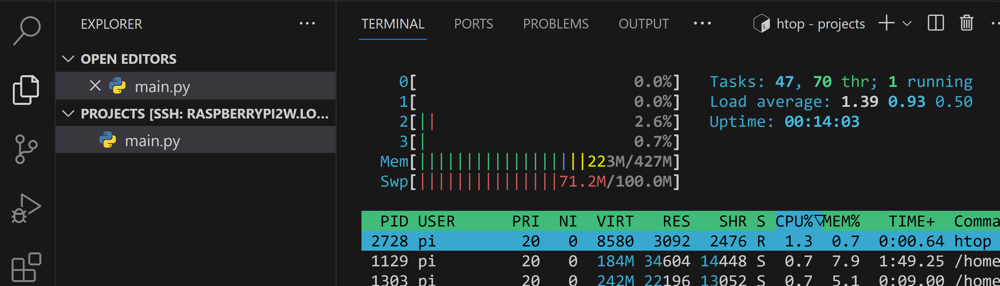
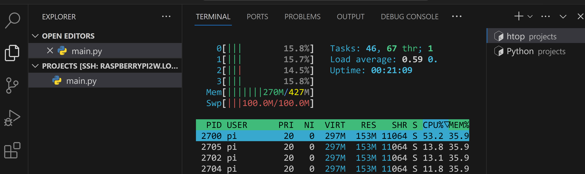

## EXTRAS - Using Older Pi's and Docker on Pi

Pages in this article:
- [Overview](./)
- [Connecting the Pi to the PC](rpi-connect-pc.md)
  - [Setup Direct Ethernet connection](rpi-vscode-ethernet)
  - [Setup USB Gadget connection](rpi-usb-gadget)
- [Setup SSH on the PC and Pi](rpi-ssh-vscode-setup)
- [Sample Python Project](python_sample_project)
- [EXTRAS- older Pis and Docker (this page)](rpi-vscode-extras.md)

Several additional topics came up during the review of this article that might be of interest.

1. How well does VSCode remote work with older Pi's like the 4, 3 and even Zero?
2. Does Docker run on the Pi 5 and can it be used with VSCode Dev Containers?  If so, is that even useful?

### VSCode Remote Dev with older Raspberry Pi's

VSCode remote development over SSH requires a target with sufficient resources (CPU and memory) as well as a compatible OS and machine architecture (for Raspberry Pi, the Debian OS and ARM processor).  Since older Pi's have the same basic OS and processor, do they have the resources to do effective remote VSCode Dev?  

Three older Pi's were tested: Pi 4 Model B with 4GB of memory; Pi 3 Model B with 1GB memory, and the Pi Zero 2W with 512MB of memory.  The connection methods (detailed in the [Connecting to the Pi document](rpi-connect-pc.md)) used were either the network or direct ethernet types (1, 2, or 3); the USB gadget mode was not used (although there is documentation at least for the Pi 4, see [Ben's excellent article](https://www.hardill.me.uk/wordpress/2019/11/02/pi4-usb-c-gadget/)).  In general these older models were able to be used for VSCode remote dev, with varying results.

#### Pi 4 Model B, 4GB Memory

The Pi was loaded with the latest 64 bit Lite OS version offered by the Pi imager program.  Connection methods 1, 2, and 3 were tested, all worked correctly.  The direct ethernet method did exhibit some delay in DNS resolution when communicating through ICS sharing on the PC, but was still able to do an OS update in reasonable time (under a minute).  Once the SSH key was configured on the PI (using the [exact same procedure as for the Pi 5](rpi-ssh-vscode-setup.md)), VSCode linked up to the Pi 4 and configured the VSCode shim server with no problem.

For testing resources and responsiveness the Python extensions were loaded through VSCode (those run on the Pi since they need access to the files on the Pi file system).  A small Python program was written and run.  Responsiveness was good, little noticeable lag.  The resources looked like:

Resources are reasonable and should allow for some large programs and more extensions.  The Pi 4 was produced in 1, 2, 4 and 8GB versions; given the results of this simple test the 2GB version would probably still be useful for smaller programs, but the 1GB may be a challenge to use.  You could try loading an older 32-bit version of the OS; those generally have lower memory requirements (see the Pi 2W below).

#### Pi 3 Model B, 1GB Memory

The same approach was taken with the Pi 3 as with the 4: latest 64 bit Lite OS version; connection methods 1, 2, and 3; tested with Python extensions and a small program.  Note, however, that the latest OS version for the 3 is older than for the 4 and 5, so it does generally use less memory.  The CPU consumption however seemed a bit higher on average.  Responsiveness was ok although there was some lag at times, and the DNS resolution was a bit slow as on the Pi 4.  Resources looked like:

With the lower memory footprint of the older OS you could probably get a reasonably sized program under development on the Pi 3 (it only came with 1GB memory).  Again you could try loading the 32 bit variant of the OS to see if a bit more memory can be freed up.

#### Pi 2W, 512MB memory

The Pi 2W has less resources and no built-in Ethernet so it was tested differently than the other two above.  The latest 32-bit Lite OS version was used (see note below about 64 bit); only connection method 1 (with WiFi); and again a small Python program with extensions.  As with the Pi 3 this is an older version of the OS than with the Pi 4 and 5.

With the reduced resources available the Pi 2W use with VSCode remote is challenging.  Initially a 64-bit version of the OS was loaded but failed immediately when VSCode tried to setup the remote server shim.  With the 32 bit version the operation was stable, at least for the nominal test configuration done.

Before VSCode remote is connected, the base OS usage is fairly light:

When VSCode is first connected and Python extensions are loaded memory usage increases substantially:

Note that the extensions don't startup right away; they start when needed, as when a program is opened:

At this point the interaction with VSCode is getting laggy but still usable.  Once the simple test is run, though, the CPU utilization goes up and the interface is slower:

So while the remote connection from VSCode can be made to the Pi 2W, it is only efficient for fairly small developments.

### VSCode Dev Containers in Docker on the Pi 5

VSCode Dev Containers is a tooling that enables a full-featured development environment within an industry standard Docker container.  There are a number of advantages to development within a container including portability and isolation of application-specific versions, configuration, etc. [This article ](https://code.visualstudio.com/docs/devcontainers/containers) is an overview of how this works along with tutorials and details of setup.  In addition there are many instructional videos available.  The typical setup is to load Docker desktop on a PC or Mac and have the Dev Container extension in VSCode create a container in the local Docker engine.

Another configuration option supported by VSCode leverages the SSH Remote extension we have been using in this article to provide a remote docker engine connection for the Dev Container extension where:

- The docker engine is installed on a remote Linux host; this is a "native" docker installation in Linux since the containers themselves are Linux machines, so the engine is relatively lightweight.
- A remote SSH connection is made to the docker-enabled Linux host the same as covered elsewhere in this article.  Note that a basic capability of the remote extension is to map the file system from the remote host such that it is accessible to VSCode.
- Finally the Dev Container extension, having access to the remote Linux file system AND the remote docker engine, can create, run and open a container that you choose on the Linux host, fully exposing it for development.

[This article](https://code.visualstudio.com/remote/advancedcontainers/develop-remote-host) gives more details how this works.  A detailed example of how this process works can be found in the appendix below.  

#### Why would you want to use a VSCode Dev Container on your Raspberry Pi?

Typically for development on the Pi you probably don't need the encapsulation or portability of a container.  You will most likely be deploying your application on the Pi as opposed to, say, a cloud container service.  However, there are a few cases where the encapsulation (or isolation) of the container can come in handy.  For example:
* You need to use some older code like libraries that don't work well under the latest Pi OS (at this writing, Bookworm).  Since the OS in the container can be specified from a broad range of distributions, you can tailor the container as needed.  This could range from some specific configuration needed to compile C/C++ code to conflicts of a Python library with the virtual environment requirement enforced by the latest Linux like Bookworm.
* You want to run a pre-packaged application on the Pi that already has a Docker image available, or you want to scaffold something like an API to use for local development before configuring a production API in the cloud (which might come with a cost) (see the Appendix below for an example).  The running container is accessible from within your base Pi development through port forwarding, shared files, etc.

While you may not use this feature often, it can be very useful for these type of edge cases or very advanced development (say, a local AI large language model running in a container with a chat agent on the base Pi?).  From a resource standpoint the VSCode extensions do a good job of keeping the memory and CPU needs reasonable; at the end of the appendix below you can see that a running container with extensions along with extensions on the base Pi take 1.2GB of the Pi 5 8GB memory including the OS with a full desktop.  Responsiveness is also very good and supports a very usable workflow should you need this capability.  Note that all testing was done with high speed SD cards or a NVME SSD on the Pi; the disk is used fairly heavily, especially when the container is being created.

### APPENDIX- Dev Container Example setup

To create a Docker Dev Container on your Pi 5, first connect with SSH from VSCode remote as documented in the [main part of this article](./README.md). Note that for this example only network connections (WiFi or Ethernet) were used; there is no technical reason the USB Gadget mode won't work but it is not as efficient as the network methods (see [here](rpi-connect-pc.md) for the list of methods).  Also, to test the resource load as much as possible a full Pi OS desktop was loaded.

After connecting to the Pi bring up a terminal and install Docker.  [This article](https://pimylifeup.com/raspberry-pi-docker/) gives an easy to follow method for installing and setting up Docker that will run whenever the Pi starts.

Assuming you are creating a new project in the dev container, create a project folder and open it in VSCode.

Now open your command palette (F1 or CTRL-Shift-P) and search for "dev" to see a list of commands the Dev Container extension provides.  Note that the extension provides a number of ways to create new containers or open existing code or repositories in a container.  The command highlighted will open the existing folder in a new container while keeping any project files on the base Pi file system.

Since in this example flow this is creating a new container from a blank folder, the Dev Container extension will prompt for the configuration data needed to spin up the container.  First is the base OS template; in this case we will develop a simple Python API so we will pick one of the templates from Microsoft that has Python all setup for us.  There are many container templates from both Microsoft and the community; the documentation noted above has full details.

Next, depending on the template chosen, there may be additional configuration data needed.  In this example case since Python was chosen as the base, the extension lets you pick a python and Linux OS version; in this case we are picking Python 3.11 and the Bullseye OS version (possibly for some compatibility needs as noted above).

The extension may request other configuration information for the template chosen.  Most of the templates will finally let you choose to add some features to the container configuration.  Features are programs to be installed (or in some cases scripts to be run) when the container is started.  There is usually a large list of features available, from simple to large (like other languages including PHP, Ruby, etc.).  In addition, you can run startup scripts by configuring shell commands after the container configuration is completed which will apply on the next startup (containers are idempotent, meaning they get created fresh each time they are started, thus the reason why our configuration data and programs are stored on the base filesystem of the Pi).  In this example we are just asking for the Github CLI to be installed as a test.

The extension will then save the configuration in a new file called devcontainer.json, communicate with the Docker engine to create a new container, start the container, and re-connect the remote communications to the new container (still through SSH on the base Pi).  Note that the remote descriptor in the lower left shows this "double hop" into the container.  Also the configuration file shows the base template we chose (actually a docker image) plus the feature we added:

The base template we chose generally will have various programs already installed (in addition to any features we selected), along with VSCode extensions that have been pre-configured.  Also note that the file system in the container has mappings back to the base Pi file system so our configuration and programs will persist when the container is shut down.

You can also install additional extensions to aid your development in the container just as you can using VSCode remote to the base Pi.  But unlike the base Pi, since the container itself is not persistent you will need to update the configuration file to reload the desired extension when the container is re-started.  The following sequence shows a simple helper extension that is installed as usual; then a helper menu will add the extension name to the configuration file so it is loaded again on startup.

Now we're ready to do some development.  We could write some Python code, but notice in one of the earlier screen shots the Dev Container extension loaded Github Copilot and Copilot Chat in the container.  That is because it recognized that Github Copilot was installed and configured on the PC so it loaded and authorized it in the container.  So let's use Copilot to scaffold a simple API that we can use in our development ([This article](https://docs.github.com/en/copilot/using-github-copilot/getting-started-with-github-copilot?tool=vscode) gives an intro to Copilot):

The AI agent also gives us instructions on how to run the API within our dev environment as well as generate a requirements.txt file for installing dependencies:

Following the Copilot instructions by copying the code into a main.py file, generating the requirements.txt file and installing the dependencies with `sudo pip install -r requirements.txt`, then running the command given by copilot starts a server for the API:

VSCode automatically recognizes the port used by the code and forwards localhost port 8000 out to the PC, letting us browse to the API:

The API from the container can also be made available to code running on the Pi by using standard Docker commands.

To disconnect VSCode from the dev container just use the normal remote close command:

Note that the dev container is still running.  This would allow, for example, the API server to continue to run and be used for development on the Pi.  You can stop the container with standard docker commands:

The container image is still stored in docker on the Pi. So unless you delete it, the next time you go through this procedure on the same project directory VSCode will be able to load up the existing image for continued development.

As noted above, Dev Containers do take resources.  With the full desktop OS loaded along with the extensions for Python on both the base Pi and the container, the memory usage looks like:

So for larger developments an 8GB Pi 5 would offer the most headroom.  But a 4GB model may work fine for moderate developments, especially if you just need a container with a development helper like the API example above.
