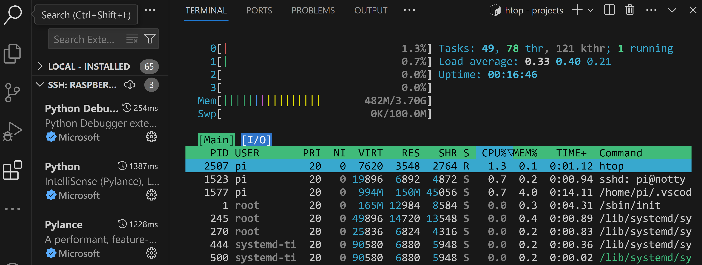
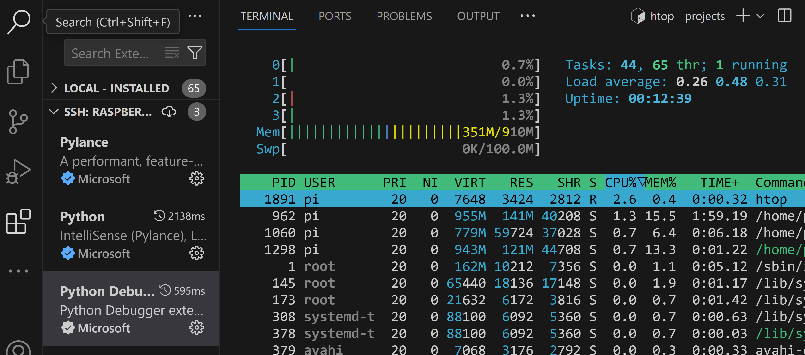

## EXTRAS - Using Older Pi's and Docker on Pi

Pages in this article:
- [Overview](./)
- [Connecting the Pi to the PC](rpi-connect-pc.md)
  - [Setup Direct Ethernet connection](rpi-vscode-ethernet)
  - [Setup USB Gadget connection](rpi-usb-gadget)
- [Setup SSH on the PC and Pi](rpi-ssh-vscode-setup)
- [Sample Python Project](python_sample_project)
- [EXTRAS- older Pis and Docker (this page)](rpi-vscode-extras.md)

Several additional topics came up during the review of this article that might be of interest.

1. How well does VSCode remote work with older Pi's like the 4, 3 and even Zero?
2. Does Docker run on the Pi 5 and can it be used with VSCode Dev Containers?  If so, is that even useful?

### VSCode Remote Dev with older Raspberry Pi's

VSCode remote development over SSH requires a target with sufficient resources (CPU and memory) as well as a compatible OS and machine architecture (for Raspberry Pi, the Debian OS and ARM processor).  Since older Pi's have the same basic OS and processor, do they have the resources to do effective remote VSCode Dev?  

Three older Pi's were tested: Pi 4 Model B with 4GB of memory; Pi 3 Model B with 1GB memory, and the Pi Zero 2W with 512MB of memory.  The connection methods (detailed in the [Connecting to the Pi document](rpi-connect-pc.md)) used were either the network or direct ethernet types (1, 2, or 3); the USB gadget mode was not used (although there is documentation at least for the Pi 4, see [Ben's excellent article](https://www.hardill.me.uk/wordpress/2019/11/02/pi4-usb-c-gadget/)).  In general these older models were able to be used for VSCode remote dev, with varying results.

#### Pi 4 Model B, 4GB Memory

The Pi was loaded with the latest 64 bit Lite OS version offered by the Pi imager program.  Connection methods 1, 2, and 3 were tested, all worked correctly.  The direct ethernet method did exhibit some delay in DNS resolution when communicating through ICS sharing on the PC, but was still able to do an OS update in reasonable time (under a minute).  Once the SSH key was configured on the PI (using the [exact same procedure as for the Pi 5](rpi-ssh-vscode-setup.md)), VSCode linked up to the Pi 4 and configured the VSCode shim server with no problem.

For testing resources and responsiveness the Python extensions were loaded through VSCode (those run on the Pi since they need access to the files on the Pi file system).  A small Python program was written and run.  Responsiveness was good, little noticeable lag.  The resources looked like:

Resources are reasonable and should allow for some large programs and more extensions.  The Pi 4 was produced in 1, 2, 4 and 8GB versions; given the results of this simple test the 2GB version would probably still be useful for smaller programs, but the 1GB may be a challenge to use.  You could try loading an older 32-bit version of the OS; those generally have lower memory requirements (see the Pi 2W below).

#### Pi 3 Model B, 1GB Memory

The same approach was taken with the Pi 3 as with the 4: latest 64 bit Lite OS version; connection methods 1, 2, and 3; tested with Python extensions and a small program.  Note, however, that the latest OS version for the 3 is older than for the 4 and 5, so it does generally use less memory.  The CPU consumption however seemed a bit higher on average.  Responsiveness was ok although there was some lag at times, and the DNS resolution was a bit slow as on the Pi 4.  Resources looked like:

With the lower memory footprint of the older OS you could probably get a reasonably sized program under development on the Pi 3 (it only came with 1GB memory).  Again you could try loading the 32 bit variant of the OS to see if a bit more memory can be freed up.

#### Pi 2W, 512MB memory

The Pi 2W has less resources and no built-in Ethernet so it was tested differently than the other two above.  The latest 32-bit Lite OS version was used (see note below about 64 bit); only connection method 1 (with WiFi); and again a small Python program with extensions.  As with the Pi 3 this is an older version of the OS than with the Pi 4 and 5.

With the reduced resources available the Pi 2W use with VSCode remote is challenging.  Initially a 64-bit version of the OS was loaded but failed immediately when VSCode tried to setup the remote server shim.  With the 32 bit version the operation was stable.
----------

tried connection methods (link) 1,2,3 on pi 4 and 3, 1 only on pi 2w.

all images were lite, pi 4 and 3 were 64 bit of the latest OS available for that device, zero 2w was tried at 64 bit but too big, worked at 32 bit

pi 4,4GB, ethernet direct, see htop image, ethernet name resolution was slow (5 secs to start pinging google) *** internet issue??

pi 3, 1GB, ethernet direct, also slow name resolution *** internet issue???, see htop image

pi2w, 512MB.  Wifi (no ethernet adapter), able to connect with vscode, load extensions (python), run a small program.  memory usage kept climbing as extensions came into play, response was laggy, but did not crash.  see htop images.

