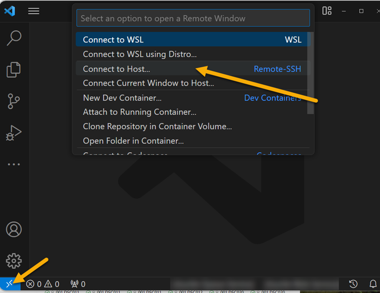
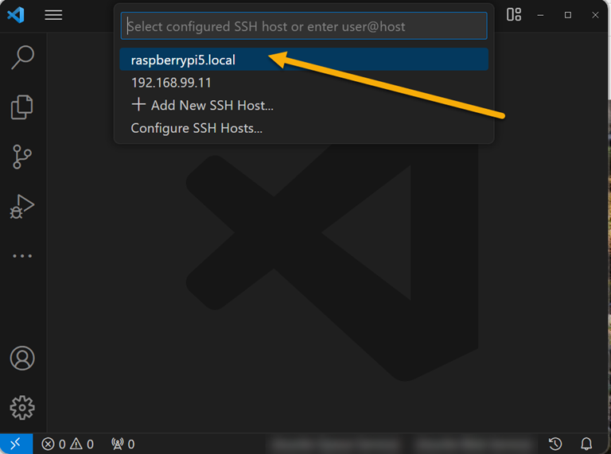

## Using a Raspberry Pi 5 as a remote Linux dev environment for Visual Studio Code

The enhanced performance of the Raspberry Pi 5 (Pi5) over previous models enables some new use cases for the Pi on the desktop.  Software development is a common use, with Visual Studio Code (VSCode) being one of the recommended software packages in the full Pi desktop version.  Based on testing with a Pi5 8MB model, VSCode installs easily and runs properly.  When accessing the Pi5 OS desktop directly (that is, with keyboard/mouse/hdmi display), the UI is reasonably snappy, more so than on the Pi4.

Developing applications on the Pi5 that involve IO such as I2C, GPIO, etc. requires that the code be run on the Pi.  While direct access to the Pi OS desktop is usable, there may be reasons this is not preferable:
* The keyboard/mouse/display may be a second setup if you normally use a desktop PC for daily use.
* If you decide to remote into the Pi with VNC or RDP you may experience some UI issues.  In testing, the mouse movements were somewhat jerky even with high speed networking and a fast PC.
* Compared to a desktop the Pi5 still has limited memory and disk bandwidth (although NVME disks through the PCiE port may help this issue when readily available).  With a full desktop loaded along with the VSCode UI (written in Electron/NodeJS which is not particularly efficient), there may not be enough memory available to develop larger applications (for example, large python programs).
* Software development almost always requires an internet connection: source control load and save, installing libraries, etc.  Putting the Pi directly on your internal network may not be desired either because of security concerns or traffic burdens.

So if you are developing for the Pi5 hardware, or you simply want a "standard" linux environment for managing packages, compilation, etc., it is helpful to have a "low touch, resource efficient" way to run code on the Pi5 but using a full featured IDE such as VSCode.

Fortunately VSCode has an extension developed specifically for this case.  The [Remote-SSH extension](https://marketplace.visualstudio.com/items?itemName=ms-vscode-remote.remote-ssh) (along with some helper extensions to enhance the experience) lets you run the full VSCode UI on your desktop and remote over SSH to the Pi5 for access to files and code execution.  Because the extension only needs to send commands and data to the Pi, a smaller "shim" (called the VS Code Server) needs to run on the Pi, not the full UI. This is the way Microsoft shows this arrangement:

Furthermore, the Local VS code on your PC manages the remote server (even installs it for you) along with utilities that give you the full VS Code experience, including debugging.  For more information see:
https://code.visualstudio.com/docs/remote/remote-overview

As noted above, you can develop with remote VS Code without having to access the Pi desktop.  In fact, unless you need the desktop for other purposes you should install the Lite version of the OS, saving disk space and memory.  There are many sources for help in OS installation, starting with the [Raspberry Pi site](https://www.raspberrypi.com/documentation/computers/getting-started.html#installing-the-operating-system).

### Connecting your PC to your Pi5 using SSH

There are two steps for using this VS Code remote development with the Pi:
1. Connect your Pi5 to your PC such that there is communication between your PC and the Pi, and the Pi has access to the internet. There are multiple ways to make the connection as detailed below.
2. Create and install an SSH key on your PC and the Pi that secures SSH login.  While you can initially login to the Pi with the password setup when you image the OS, you will not be able to use password authentication practically during development because of the number of times authentication reoccurs.  

The **second step** is covered in the document:

[VS Code SSH setup](rpi-ssh-vscode-setup.md)

The **first step** can be done a number of different ways depending on your network, hardware, etc.  Please note, power to your Pi will generally be best configured as a separate USB-C connection except for the "all in one" method #4.  While you could supply power from your laptop the USB-C port on the Pi requires a USB Power Delivery supply with sufficient current (such as Thunderbolt).  
1. ***Connect Pi to the same wireless or LAN to which your PC is connected***; the network usually contains a router giving internet access along with DHCP address management.  This is the easiest to setup if available: when you image the OS for the Pi configure a wireless SSID and password (or just plan to use Ethernet if available, which is on and setup for DHCP by default).  
This is an out-of-the-box setup on both the Pi and the PC, requiring no special networking changes.  (Note that in the Pi5 OS SSH is enabled by default.) But as noted above you may not want to connect the PI directly to your network, or you may not have a network if you simply have your PC connected to a wifi hotspot but can't have the Pi also connected.  (When you first go through the step 2 document it will be easiest to use this connection type even if you change it later for daily use)
2. Another approach which alleviates the potential public network exposure of your Pi is to ***use a small router often called a travel router***.  This forms a small private network that shares an internet connection, most offering either wireless or Ethernet connections to both the internet and device sides.  This is another out-of-the-box solution for both the Pi and PC, but does require a hardware purchase and configuration.  
For the modest bandwidth needed for remoting to your Pi, well-rated devices typically sell for under $50.  This [device](https://a.co/d/faXdwOX) was tested; it was easy to setup and performed well.  Once the router is connected to the internet the setup is the same as #1 above: connect the PC and Pi either through wireless or Ethernet and both should have internet connectivity.
3. Another approach which offers a private network for your Pi but doesn't require expensive hardware is ***using a direct ethernet connection***.  This method is out-of-the-box for the Pi but does require some minor networking configuration on the PC.  The PC can share its internet connection whether connected wired or wireless (if wired, two ethernet connections are required on the PC).  
**For a full guide on implementing this technique see [this document](rpi-vscode-ethernet.md).**
4. Finally, there is an all in one solution that ***powers the PI and sets up all the communication needed***.  This uses a feature on the Pi called USB gadget mode.  As noted above, this requires a PC (typically a laptop) with a USB-C Power Delivery port capable of at least 3A of current (such as offered typically by Thunderbolt).  The only hardware needed is a USB-C to USB-C cable to connect the PC to the power port on the Pi.  This is not an out-of-the box solution on either side; both the Pi and the PC will require networking configuration changes.  But the advantage is a very compact setup, such as for traveling.  
**For full details see [this document](rpi-usb-gadget.md).**  
**NOTE: BUG BEFORE LATE DECEMBER 2023**  
There WAS a [reported issue](https://github.com/raspberrypi/bookworm-feedback/issues/77) preventing the Pi5 from properly loading the driver required to emulate a network connection on the USB-C power port.  This existed on the Pi 5 delivered in 2023, but it is not clear when/if it was fixed in production.  There was a patch put out to the firmware in late 2023 that seems to work.  The document includes instructions for manually updating the firmware on your Pi. If you have a more recently produced Pi (look on the back for a code like YYWW where WW is the week of the year), try the setup without the firmware update to see if the fix is in production.

### Using VSCode Remote after connecting to the Pi
Once you have access to your Pi with SSH, run VSCode, load the Remote Extension as noted above, and connect within VSCode to the remote Pi as an sSH Host:

(Note, the Pi being tested was named raspberry5.local during the OS imaging, yours may be different)

Developing within VSCode now on the Pi is the same as on your local environment: you have access to the file system and terminal on the Pi, you can load extensions, and run and debug code.  See this [python sample](python_sample_project.md) for a more detailed look at how to setup projects and develop code with an IOT environmental sensor attached to the Pi.

